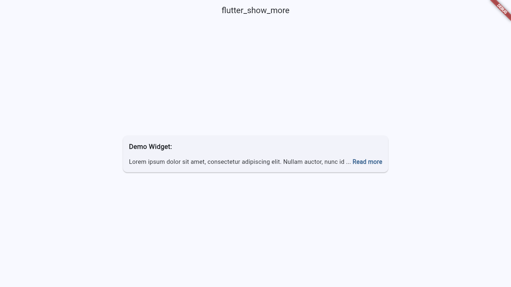

# flutter_show_more

A modern Flutter widget for limiting the amount of text to show, with "show more" and "show less" functionality. Fully compatible with Dart 3, Flutter 3, and strict null safety.

[](https://pub.dev/packages/flutter_show_more)

## Features

* Limits text visibility up to a specific character length, using grapheme-aware (`characters` API) truncation so emojis aren't split.
* Optionally handles "show less" logic.
* Fully customizable styles for text and toggles.

## Installation

Add this to your package's `pubspec.yaml` file:

```yaml
dependencies:
  flutter_show_more: ^1.0.0
```

## Usage

First, import `flutter_show_more`:

```dart
import 'package:flutter_show_more/flutter_show_more.dart';
```

Then, use `ShowMoreText`:

```dart
ShowMoreText(
  'A very long text string that you want to truncate and allow the user to expand or collapse.',
  maxLength: 100,
  style: const TextStyle(fontSize: 14, color: Colors.black87),
  showMoreText: 'show more',
  showMoreStyle: TextStyle(
    fontSize: 14,
    fontWeight: FontWeight.bold,
    color: Theme.of(context).colorScheme.primary,
  ),
  shouldShowLessText: true,
  showLessText: 'show less',
)
```

## Screenshots



## License

[MIT License](LICENSE)
